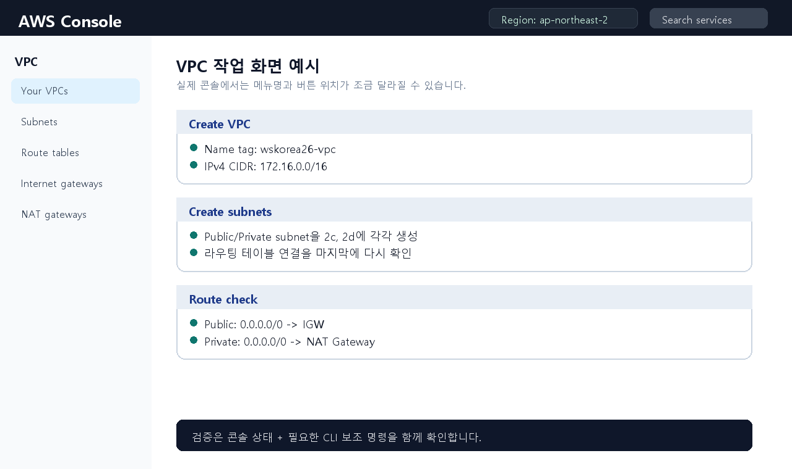
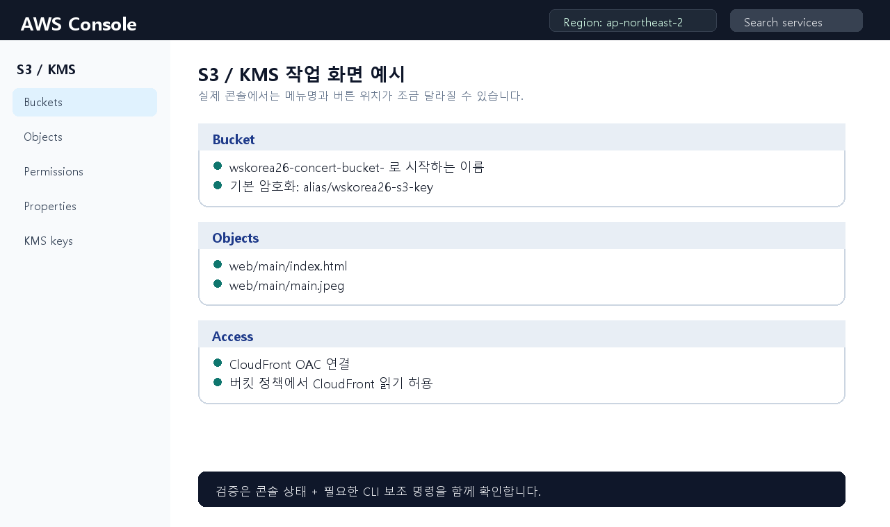
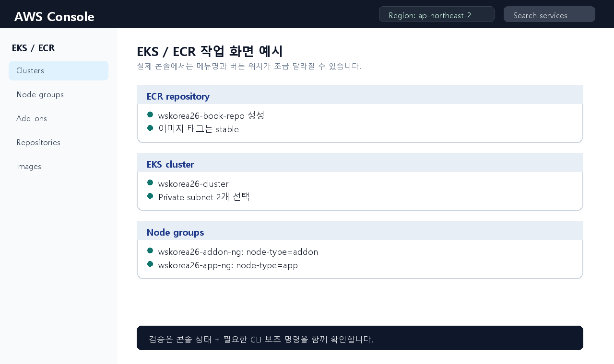
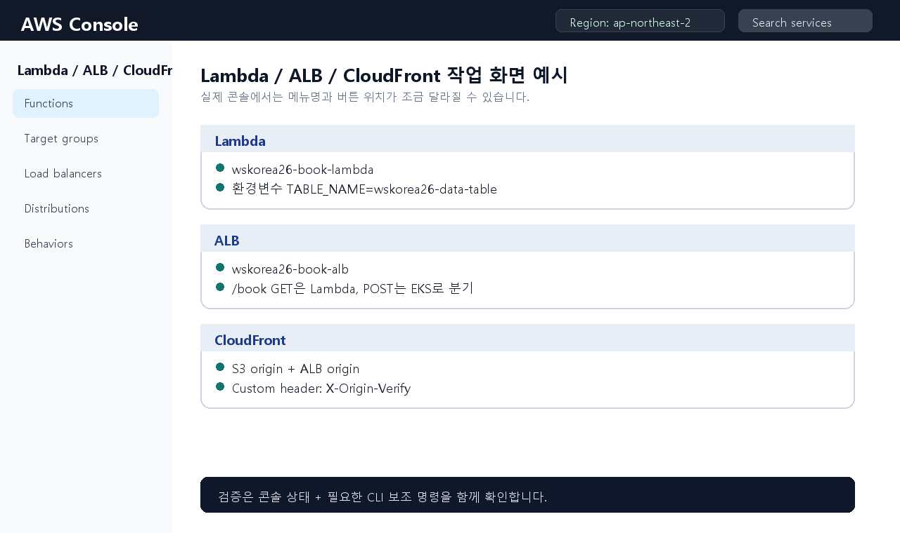
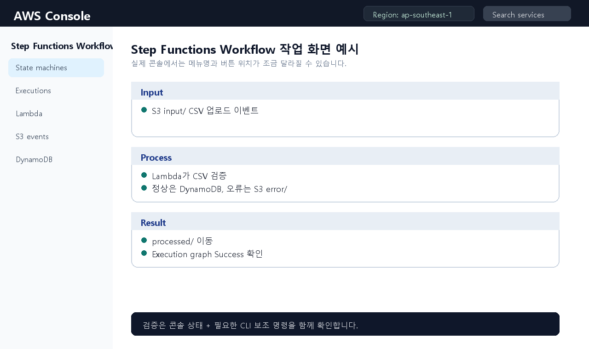
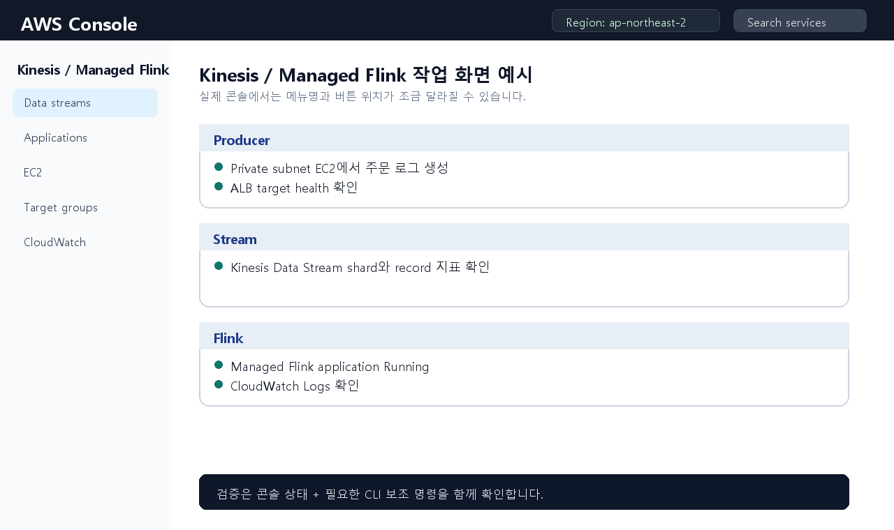
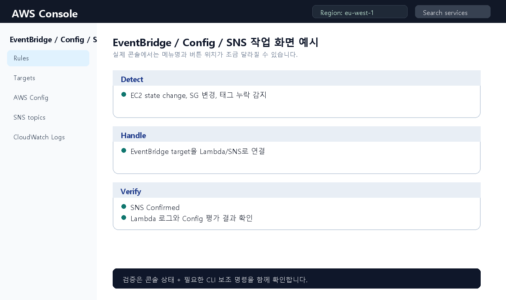
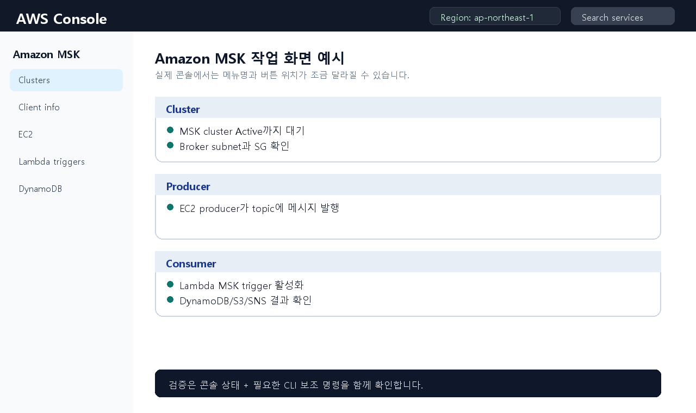

# AWS 콘솔 + CLI 보강 풀이

이 문서는 학생들이 AWS 콘솔 화면을 기준으로 따라가되, 콘솔만으로 처리하기 어려운 구간은 CLI 명령어로 보조할 수 있도록 정리한 보강 풀이입니다.

> 안내: 아래 이미지는 실제 AWS 계정 화면 캡처가 아니라 수업 설명용 콘솔 예시 이미지입니다. 실제 콘솔은 AWS UI 업데이트나 계정 권한에 따라 버튼 위치가 조금 다를 수 있습니다.

## 0. 실습 시작 전 공통 변수

CloudShell에서 먼저 아래 변수를 잡고 시작합니다. `NO` 값은 학생별 번호나 과제에서 지정한 번호로 바꿉니다.

```bash
export AWS_REGION=ap-northeast-2
export ACCOUNT_ID=$(aws sts get-caller-identity --query Account --output text)
export NO=2027
export BUCKET=wskorea26-concert-bucket-${NO}

aws configure set region ${AWS_REGION}
aws sts get-caller-identity
```

확인 포인트는 다음과 같습니다.

| 항목 | 확인 내용 |
|---|---|
| Region | `ap-northeast-2` |
| Account | 현재 실습 계정 ID가 출력되는지 확인 |
| Bucket 변수 | `wskorea26-concert-bucket-번호` 형식 |
| 재실행 주의 | KMS alias는 이미 만들었다면 다시 만들지 않음 |

## 1. KMS 키 생성

1과제는 S3, DynamoDB, EKS에서 사용할 KMS 키 alias가 채점 기준에 포함됩니다.

```bash
S3_KEY_ID=$(aws kms create-key --description wskorea26-s3-key --query KeyMetadata.KeyId --output text)
aws kms create-alias --alias-name alias/wskorea26-s3-key --target-key-id ${S3_KEY_ID}

DDB_KEY_ID=$(aws kms create-key --description wskorea26-dynamodb-key --query KeyMetadata.KeyId --output text)
aws kms create-alias --alias-name alias/wskorea26-dynamodb-key --target-key-id ${DDB_KEY_ID}

EKS_KEY_ID=$(aws kms create-key --description wskorea26-eks-key --query KeyMetadata.KeyId --output text)
aws kms create-alias --alias-name alias/wskorea26-eks-key --target-key-id ${EKS_KEY_ID}

aws kms list-aliases \
  --query "Aliases[?starts_with(AliasName, 'alias/wskorea26')].[AliasName,TargetKeyId]" \
  --output table
```

이미 alias가 생성된 상태에서 다시 실행하면 `AlreadyExistsException`이 발생할 수 있습니다. 그때는 오류가 아니라 “이미 생성됨”으로 보고 `list-aliases`만 확인합니다.

## 2. VPC 네트워크 구성



콘솔 경로는 `VPC > Your VPCs > Create VPC`입니다. 과제 채점 기준에 맞춰 VPC, Public Subnet, Private Subnet, Internet Gateway, NAT Gateway, Route Table을 구성합니다.

| 리소스 | 이름 | 값 |
|---|---|---|
| VPC | `wskorea26-vpc` | `172.16.0.0/16` |
| Public subnet C | `wskorea26-pub-subnet-c` | `172.16.0.0/20`, `ap-northeast-2c` |
| Public subnet D | `wskorea26-pub-subnet-d` | `172.16.16.0/20`, `ap-northeast-2d` |
| Private subnet C | `wskorea26-priv-subnet-c` | `172.16.32.0/20`, `ap-northeast-2c` |
| Private subnet D | `wskorea26-priv-subnet-d` | `172.16.48.0/20`, `ap-northeast-2d` |

CLI로 만들 경우 아래 명령을 사용합니다.

```bash
export VPC_CIDR=172.16.0.0/16
export PUB_C_CIDR=172.16.0.0/20
export PUB_D_CIDR=172.16.16.0/20
export PRIV_C_CIDR=172.16.32.0/20
export PRIV_D_CIDR=172.16.48.0/20

VPC_ID=$(aws ec2 create-vpc \
  --cidr-block ${VPC_CIDR} \
  --tag-specifications "ResourceType=vpc,Tags=[{Key=Name,Value=wskorea26-vpc}]" \
  --query 'Vpc.VpcId' \
  --output text)

aws ec2 modify-vpc-attribute --vpc-id ${VPC_ID} --enable-dns-support
aws ec2 modify-vpc-attribute --vpc-id ${VPC_ID} --enable-dns-hostnames
echo "VPC_ID=${VPC_ID}"
```

```bash
PUB_C=$(aws ec2 create-subnet --vpc-id ${VPC_ID} --cidr-block ${PUB_C_CIDR} --availability-zone ap-northeast-2c --tag-specifications "ResourceType=subnet,Tags=[{Key=Name,Value=wskorea26-pub-subnet-c}]" --query 'Subnet.SubnetId' --output text)
PUB_D=$(aws ec2 create-subnet --vpc-id ${VPC_ID} --cidr-block ${PUB_D_CIDR} --availability-zone ap-northeast-2d --tag-specifications "ResourceType=subnet,Tags=[{Key=Name,Value=wskorea26-pub-subnet-d}]" --query 'Subnet.SubnetId' --output text)
PRIV_C=$(aws ec2 create-subnet --vpc-id ${VPC_ID} --cidr-block ${PRIV_C_CIDR} --availability-zone ap-northeast-2c --tag-specifications "ResourceType=subnet,Tags=[{Key=Name,Value=wskorea26-priv-subnet-c}]" --query 'Subnet.SubnetId' --output text)
PRIV_D=$(aws ec2 create-subnet --vpc-id ${VPC_ID} --cidr-block ${PRIV_D_CIDR} --availability-zone ap-northeast-2d --tag-specifications "ResourceType=subnet,Tags=[{Key=Name,Value=wskorea26-priv-subnet-d}]" --query 'Subnet.SubnetId' --output text)

aws ec2 modify-subnet-attribute --subnet-id ${PUB_C} --map-public-ip-on-launch
aws ec2 modify-subnet-attribute --subnet-id ${PUB_D} --map-public-ip-on-launch
```

EKS와 ALB가 subnet을 자동으로 찾을 수 있도록 Kubernetes tag도 붙입니다.

```bash
aws ec2 create-tags --resources ${PUB_C} ${PUB_D} \
  --tags Key=kubernetes.io/role/elb,Value=1 \
         Key=kubernetes.io/cluster/wskorea26-cluster,Value=shared

aws ec2 create-tags --resources ${PRIV_C} ${PRIV_D} \
  --tags Key=kubernetes.io/role/internal-elb,Value=1 \
         Key=kubernetes.io/cluster/wskorea26-cluster,Value=shared
```

Internet Gateway, NAT Gateway, Route Table을 연결합니다.

```bash
IGW_ID=$(aws ec2 create-internet-gateway \
  --tag-specifications "ResourceType=internet-gateway,Tags=[{Key=Name,Value=wskorea26-igw}]" \
  --query 'InternetGateway.InternetGatewayId' \
  --output text)

aws ec2 attach-internet-gateway --internet-gateway-id ${IGW_ID} --vpc-id ${VPC_ID}

EIP_C=$(aws ec2 allocate-address --domain vpc --query 'AllocationId' --output text)
EIP_D=$(aws ec2 allocate-address --domain vpc --query 'AllocationId' --output text)

NAT_C=$(aws ec2 create-nat-gateway --subnet-id ${PUB_C} --allocation-id ${EIP_C} --tag-specifications "ResourceType=natgateway,Tags=[{Key=Name,Value=wskorea26-nat-gw-c}]" --query 'NatGateway.NatGatewayId' --output text)
NAT_D=$(aws ec2 create-nat-gateway --subnet-id ${PUB_D} --allocation-id ${EIP_D} --tag-specifications "ResourceType=natgateway,Tags=[{Key=Name,Value=wskorea26-nat-gw-d}]" --query 'NatGateway.NatGatewayId' --output text)

aws ec2 wait nat-gateway-available --nat-gateway-ids ${NAT_C} ${NAT_D}
```

```bash
PUB_RTB=$(aws ec2 create-route-table --vpc-id ${VPC_ID} --tag-specifications "ResourceType=route-table,Tags=[{Key=Name,Value=wskorea26-public-rtb}]" --query 'RouteTable.RouteTableId' --output text)
PRIV_RTB_C=$(aws ec2 create-route-table --vpc-id ${VPC_ID} --tag-specifications "ResourceType=route-table,Tags=[{Key=Name,Value=wskorea26-private-rtb-c}]" --query 'RouteTable.RouteTableId' --output text)
PRIV_RTB_D=$(aws ec2 create-route-table --vpc-id ${VPC_ID} --tag-specifications "ResourceType=route-table,Tags=[{Key=Name,Value=wskorea26-private-rtb-d}]" --query 'RouteTable.RouteTableId' --output text)

aws ec2 create-route --route-table-id ${PUB_RTB} --destination-cidr-block 0.0.0.0/0 --gateway-id ${IGW_ID}
aws ec2 create-route --route-table-id ${PRIV_RTB_C} --destination-cidr-block 0.0.0.0/0 --nat-gateway-id ${NAT_C}
aws ec2 create-route --route-table-id ${PRIV_RTB_D} --destination-cidr-block 0.0.0.0/0 --nat-gateway-id ${NAT_D}

aws ec2 associate-route-table --route-table-id ${PUB_RTB} --subnet-id ${PUB_C}
aws ec2 associate-route-table --route-table-id ${PUB_RTB} --subnet-id ${PUB_D}
aws ec2 associate-route-table --route-table-id ${PRIV_RTB_C} --subnet-id ${PRIV_C}
aws ec2 associate-route-table --route-table-id ${PRIV_RTB_D} --subnet-id ${PRIV_D}
```

검증 명령입니다.

```bash
aws ec2 describe-vpcs \
  --vpc-ids ${VPC_ID} \
  --query 'Vpcs[*].[VpcId,CidrBlock,Tags[?Key==`Name`].Value|[0]]' \
  --output table

aws ec2 describe-subnets \
  --filters Name=vpc-id,Values=${VPC_ID} \
  --query 'Subnets[*].[SubnetId,CidrBlock,AvailabilityZone,MapPublicIpOnLaunch,Tags[?Key==`Name`].Value|[0]]' \
  --output table
```

## 3. S3 정적 파일 구성



콘솔 경로는 `S3 > Buckets > Create bucket`입니다. 버킷 이름은 학생별 번호를 붙여 전역 중복을 피합니다.

```bash
aws s3api create-bucket \
  --bucket ${BUCKET} \
  --region ${AWS_REGION} \
  --create-bucket-configuration LocationConstraint=${AWS_REGION}

aws s3api put-bucket-encryption \
  --bucket ${BUCKET} \
  --server-side-encryption-configuration '{
    "Rules": [{
      "ApplyServerSideEncryptionByDefault": {
        "SSEAlgorithm": "aws:kms",
        "KMSMasterKeyID": "alias/wskorea26-s3-key"
      }
    }]
  }'
```

제공 파일을 `web/main/` 경로로 업로드합니다.

```bash
aws s3 cp index.html s3://${BUCKET}/web/main/index.html
aws s3 cp main.jpeg s3://${BUCKET}/web/main/main.jpeg
aws s3 ls s3://${BUCKET}/web/main/
```

## 4. DynamoDB 구성

콘솔 경로는 `DynamoDB > Tables > Create table`입니다.

| 항목 | 값 |
|---|---|
| Table name | `wskorea26-data-table` |
| Partition key | `client_id` |
| Type | String |
| Encryption | `alias/wskorea26-dynamodb-key` |

```bash
aws dynamodb create-table \
  --table-name wskorea26-data-table \
  --attribute-definitions AttributeName=client_id,AttributeType=S \
  --key-schema AttributeName=client_id,KeyType=HASH \
  --billing-mode PAY_PER_REQUEST \
  --sse-specification Enabled=true,SSEType=KMS,KMSMasterKeyId=alias/wskorea26-dynamodb-key

aws dynamodb wait table-exists --table-name wskorea26-data-table
aws dynamodb describe-table --table-name wskorea26-data-table --query 'Table.[TableName,TableStatus,KeySchema]'
```

## 5. ECR와 EKS



콘솔에서 ECR repository를 만들고, Docker image는 CLI로 push합니다.

```bash
aws ecr create-repository --repository-name wskorea26-book-repo

aws ecr get-login-password --region ${AWS_REGION} \
  | docker login --username AWS --password-stdin ${ACCOUNT_ID}.dkr.ecr.${AWS_REGION}.amazonaws.com

docker build -t wskorea26-book-repo:stable .
docker tag wskorea26-book-repo:stable ${ACCOUNT_ID}.dkr.ecr.${AWS_REGION}.amazonaws.com/wskorea26-book-repo:stable
docker push ${ACCOUNT_ID}.dkr.ecr.${AWS_REGION}.amazonaws.com/wskorea26-book-repo:stable
```

EKS는 콘솔에서 `wskorea26-cluster`를 생성하고 private subnet을 선택합니다. 이후 kubeconfig와 manifest 적용은 CLI가 필요합니다.

```bash
aws eks update-kubeconfig --region ${AWS_REGION} --name wskorea26-cluster
kubectl get nodes --show-labels
kubectl create namespace wskorea26
kubectl apply -n wskorea26 -f <제공_manifest_파일>
kubectl get pod,svc,ingress -n wskorea26 -o wide
```

## 6. Lambda, ALB, CloudFront



Lambda 콘솔에서 `wskorea26-book-lambda`를 만들고 환경변수 `TABLE_NAME=wskorea26-data-table`을 넣습니다.

ALB는 public subnet에 만들고, listener rule에서 `/book` 경로를 처리합니다.

CloudFront는 origin을 2개 둡니다.

| Origin | 역할 |
|---|---|
| S3 origin | `/`, `/main.jpeg` 정적 파일 |
| ALB origin | `/book` API |

CloudFront origin custom header는 다음 값을 사용합니다.

| Header | Value |
|---|---|
| `X-Origin-Verify` | `wskorea26-cf` |

최종 검증은 CloudFront 도메인으로 진행합니다.

```bash
curl -i https://<CLOUDFRONT_DOMAIN>/
curl -i https://<CLOUDFRONT_DOMAIN>/main.jpeg

curl -i -X POST https://<CLOUDFRONT_DOMAIN>/book \
  -H 'Content-Type: application/json' \
  -d '{"client_id":"test01","concert_name":"Korea Skills Concert"}'

curl -i 'https://<CLOUDFRONT_DOMAIN>/book?concert_name=Korea%20Skills%20Concert'
```

## 7. 2과제 모듈별 보강 흐름

2과제는 모듈마다 리전이 다릅니다. 콘솔 오른쪽 위 리전을 먼저 바꾸고 작업합니다.

| 모듈 | 리전 | 핵심 서비스 |
|---|---|---|
| Module 1 Workflow | `ap-southeast-1` | S3, Lambda, DynamoDB, Step Functions |
| Module 2 Analytics | `ap-northeast-2` | EC2, ALB, Kinesis, Managed Flink |
| Module 3 Event Handling | `eu-west-1` | EventBridge, AWS Config, Lambda, SNS |
| Module 4 MSK | `ap-northeast-1` | MSK, EC2 Producer, Lambda Consumer |

### Module 1 Workflow



```bash
aws configure set region ap-southeast-1
aws s3 cp sample.csv s3://<MODULE1_BUCKET>/input/sample.csv
aws stepfunctions list-executions --state-machine-arn <STATE_MACHINE_ARN> --max-results 5
aws dynamodb scan --table-name <TABLE_NAME> --max-items 5
```

### Module 2 Real-time Analytics



```bash
aws configure set region ap-northeast-2
unzip module2.zip
bash mark2-2.sh
aws kinesis describe-stream-summary --stream-name <STREAM_NAME>
aws logs tail /aws/kinesis-analytics/<APP_NAME> --follow
```

### Module 3 Cloud Event Handling



```bash
aws configure set region eu-west-1
aws ec2 stop-instances --instance-ids <INSTANCE_ID>
aws ec2 authorize-security-group-ingress --group-id <SG_ID> --protocol tcp --port 22 --cidr 0.0.0.0/0
aws logs tail /aws/lambda/<FUNCTION_NAME> --since 10m
aws sns list-subscriptions-by-topic --topic-arn <TOPIC_ARN>
```

### Module 4 MSK



```bash
aws configure set region ap-northeast-1
aws kafka get-bootstrap-brokers --cluster-arn <MSK_CLUSTER_ARN>
/opt/kafka/bin/kafka-topics.sh --bootstrap-server <BOOTSTRAP> --create --topic <TOPIC_NAME> --partitions 1 --replication-factor 2
/opt/kafka/bin/kafka-console-producer.sh --bootstrap-server <BOOTSTRAP> --topic <TOPIC_NAME>
aws dynamodb scan --table-name <RESULT_TABLE> --max-items 5
aws logs tail /aws/lambda/<MSK_CONSUMER_FUNCTION> --since 10m
```

## 8. 최종 제출 전 체크리스트

- [ ] KMS alias 3개가 정확하다.
- [ ] VPC, subnet, route table 이름과 CIDR이 정확하다.
- [ ] Public subnet은 public IP 자동 할당이 켜져 있다.
- [ ] Private subnet은 NAT Gateway로 외부 통신이 가능하다.
- [ ] EKS/ALB용 subnet tag가 붙어 있다.
- [ ] S3 객체 경로가 `web/main/index.html`, `web/main/main.jpeg`이다.
- [ ] DynamoDB partition key가 `client_id`이다.
- [ ] ECR image tag가 `stable`이다.
- [ ] CloudFront에서 정적 페이지와 `/book` API가 모두 동작한다.
- [ ] 2과제는 모듈별 리전이 정확하다.
